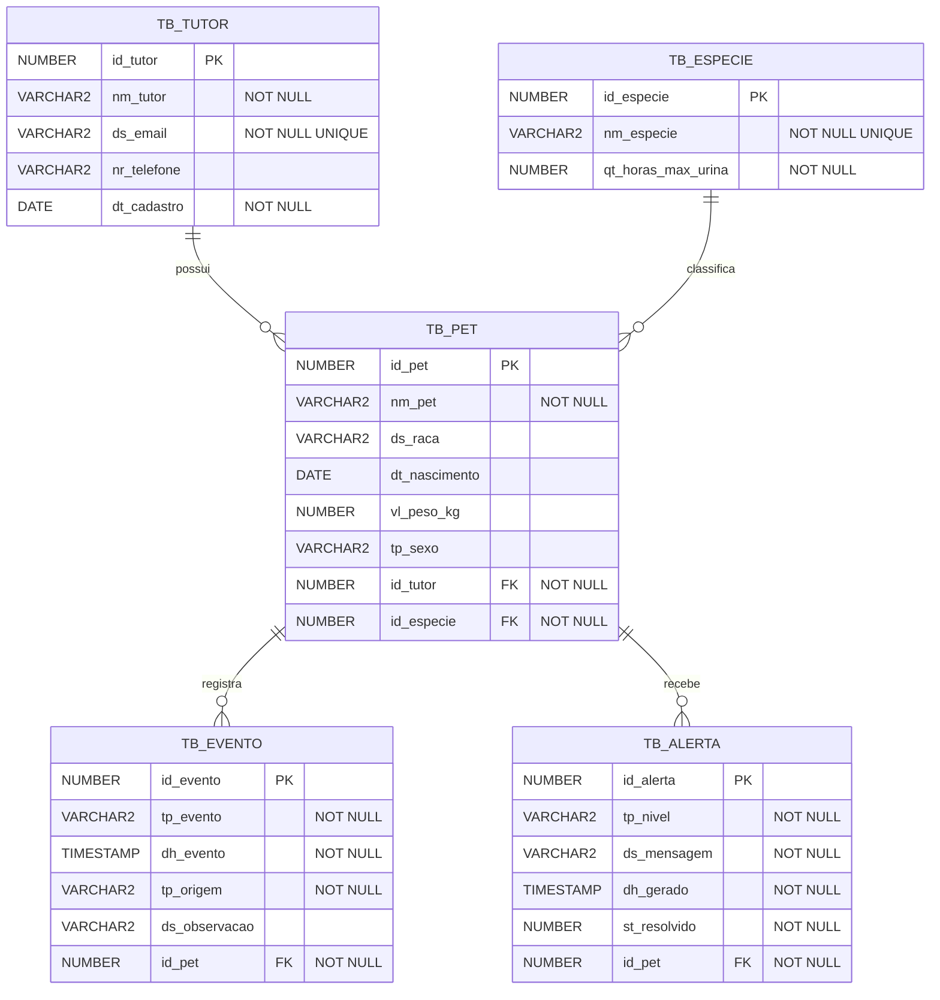

# Diagrama Entidade–Relacionamento (DER)

> Modelo físico do banco de dados Oracle/H2 do projeto SOLIN.

## Coerência com o Diagrama de Classes

Cada entidade JPA do diagrama de classes mapeia diretamente para uma tabela aqui:

| Classe (JPA) | Tabela | PK |
|---|---|---|
| `Tutor` | `TB_TUTOR` | `id_tutor` |
| `Especie` | `TB_ESPECIE` | `id_especie` |
| `Pet` | `TB_PET` | `id_pet` |
| `Evento` | `TB_EVENTO` | `id_evento` |
| `Alerta` | `TB_ALERTA` | `id_alerta` |

Os enums (`TipoEvento`, `NivelAlerta`, `OrigemEvento`, `Sexo`) são persistidos como `VARCHAR2` pelo Hibernate via `@Enumerated(EnumType.STRING)` — opção escolhida ao invés de `ORDINAL` porque manter a string facilita a leitura direta no banco e evita problemas se a ordem dos valores do enum mudar no futuro.

## Índices

| Índice | Tabela | Colunas | Motivo |
|---|---|---|---|
| `IX_EVENTO_PET_DH` | `TB_EVENTO` | `(id_pet, dh_evento)` | Acelera a query `findUltimoEventoPorTipo` usada pelas Strategies de alerta |

## Cascateamento

Quando um `Tutor` é excluído, todos os `Pets` dele são excluídos (cascade). Quando um `Pet` é excluído, todos os `Eventos` e `Alertas` dele também são (cascade + orphanRemoval). Isso evita registros órfãos no banco.
