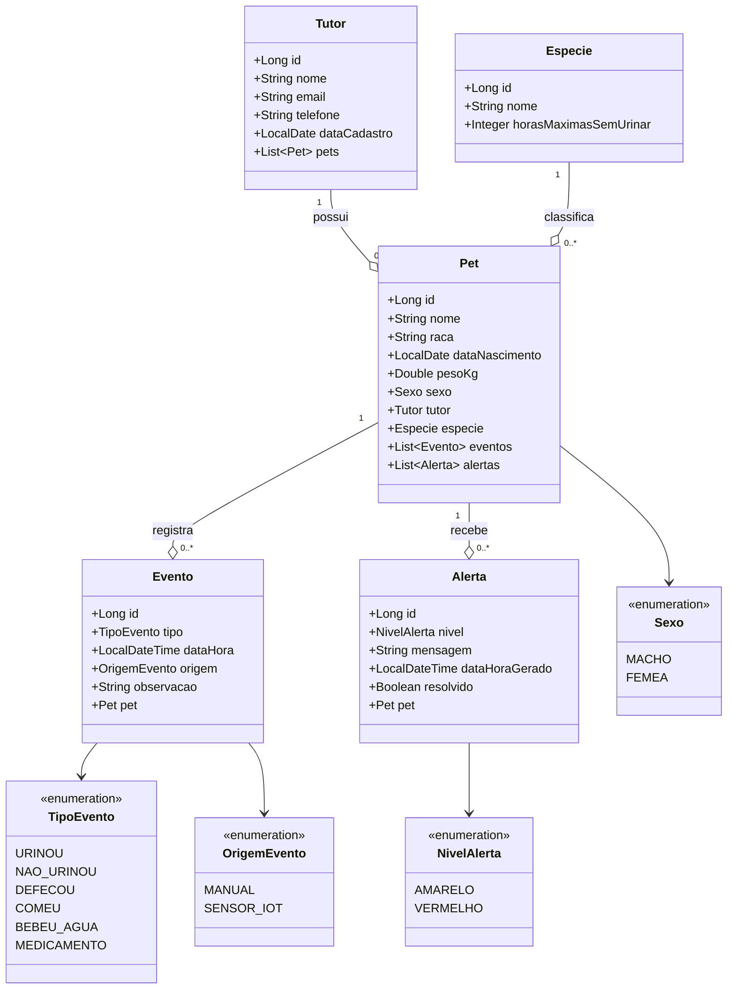

# Diagrama de Classes — Entidades SOLIN

> Representação das entidades do domínio, atributos principais e relacionamentos JPA.

## Relacionamentos e constraints

| Relação | Cardinalidade | Constraint |
|---|---|---|
| Tutor → Pet | 1 : N | Pet **NOT NULL** em `id_tutor`. Cascade ALL + orphanRemoval no Tutor |
| Especie → Pet | 1 : N | Pet **NOT NULL** em `id_especie` |
| Pet → Evento | 1 : N | Evento **NOT NULL** em `id_pet`. Cascade ALL + orphanRemoval |
| Pet → Alerta | 1 : N | Alerta **NOT NULL** em `id_pet`. Cascade ALL + orphanRemoval |

### Outras constraints
- `Tutor.email` é **UNIQUE** e NOT NULL
- `Especie.nome` é **UNIQUE**
- `Evento` tem índice composto em `(id_pet, dh_evento)` para acelerar a query do último evento por tipo (usada pelo Strategy de alerta)
- Todos os relacionamentos `@ManyToOne` usam `FetchType.LAZY` para evitar joins desnecessários
